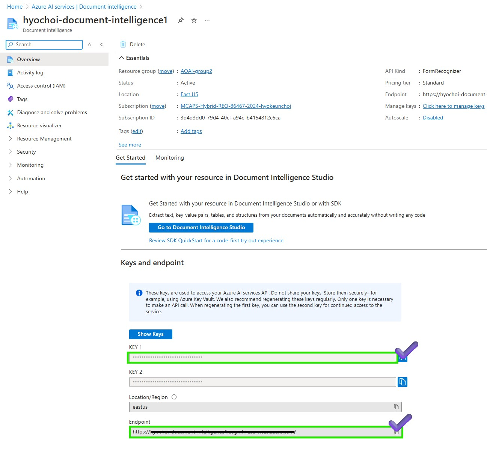
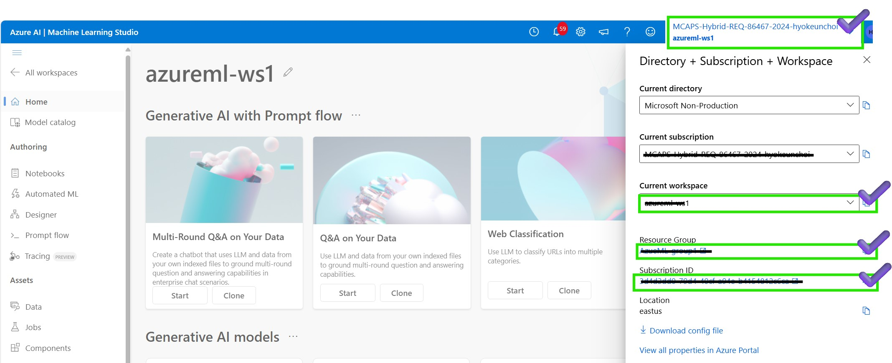

# Lab 0. Requirements (Skip if you have already set up)

## 1. Requirements

### Checklist

{: .note }
Customers who participate in this hands-on lab will need to discuss with their Microsoft sales representative and complete the checklist. The checklist will ultimately be completed by the sales representative, but we ask that you cooperate in completing the checklist to ensure the right situation/right person is involved.

{: .warning}
Please create a resource in one of following regions when creating a AI Document Intelligence resource: **East-US, West-US2, West-Europe**. Otherwise, you may encounter a 404 error when trying to access the resource. ([Source](https://learn.microsoft.com/en-us/answers/questions/1514842/document-intelligence-ai-returns-404))

### Hands-on Requirements
- Ensure you have access to [Azure OpenAI] Service.
- Set up your [Azure ML] workspace and get your `<WORKSPACE_NAME>`, `<RESOURCE_GROUP>` and `<SUBSCRIPTION_ID>`.
- Create a project in [Azure AI Foundry].
- For LLM training, recommend a single NVIDIA A100 GPU (**[Standard_NC24ads_A100_v4]**). Opt for Low-priority VMs if on a budget or without a dedicated quota.
- For LLM serving, we recommend two NVIDIA V100 GPUs (**[Standard_NC6s_v3]**). Please refer to the note below for why 2 GPUs are required instead of 1 for Azure ML serving.

### Deploying Azure resources with Azure Developer CLI(azd)
In case you're looking for the easiest way to get started, this lab provides Bicep to provision everything with ease. The steps below will provision required Azure resources. Download the CLI from the [What is the Azure Developer CLI?](https://learn.microsoft.com/en-us/azure/developer/azure-developer-cli/overview?tabs=windows#a-sample-azd-workflow) if you don't have it installed yet. 

Login to your Azure account:

```shell
azd auth login
```

For GitHub Codespaces users, if the previous command fails, try:

```shell
 azd auth login --use-device-code
```

Run azd up - This will provision Azure resources including Azure ML workspace, Azure OpenAI resources, Application Insights, and Azure Document Intelligence.

```shell

azd up
```
**Important**: Beware that the resources created by this command will incur immediate costs, primarily from the AI Search resource. These resources may accrue costs even if you interrupt the command before it is fully executed. You can run `azd down` or delete the resources manually to avoid unnecessary spending.
You will be prompted to select two locations, one for the majority of resources and one for the OpenAI resource, which is currently a short list. That location list is based on the OpenAI model availability table and may become outdated as availability changes.
After the application has been successfully deployed you will see a URL printed to the console. Click that URL to interact with the application in your browser. It will look like the following:

### Cautions
- **Request [Standard_NC6s_v3] GPU quota increase (\*12 core) for serving.** 
- If configuring in a private environment, set up a private network or VPN to access services.
- **[Low-priority VM]** availability may vary by region.
- Set up connections for any blob storage used to store data and models within the Azure ML workspace.
- Request a quota increase if necessary for VMs or GPUs.
- Network config in Azure ML workspace cannot be changed post-setup; create a new workspace if required.
- Ensure compute instances are in the same region as the Azure ML workspace; otherwise, set up a VPN or private link.
- If using Azure AI Foundry compute instances, note that training jobs cannot be executed on them.

{: .note }
For managed online endpoints, [Azure ML reserves 20% of the quota for the deployment].[^1] If you request a given number of instances for those VM SKUs in a deployment, you must have a quota for `ceil(1.2 × number of instances requested for deployment) × number of cores for the VM SKU` available to avoid getting an error. For example, if you request 1 instances of a `Standard_NC6s_v3` VM (that comes with six cores) in a deployment, you should have a quota for 12 cores (ceil(1.2 × 1 instances) = 2, 2 × 6 cores) available.  

Please ensure these points are followed to avoid common issues during the workshop.

## 2. Setup Compute Instance and the configuration file
- 1️⃣ Prepare your compute resource
- 2️⃣ Clone the repository
- 3️⃣ Create `.env` file and Add Azure OpenAI and Azure Document Intelligence details
- 4️⃣ Setup config.yml
- 🚀 Get started to validate the setup 

### 1️⃣ Prepare your compute resource
1. Create your compute instance in Azure ML Studio. Navigate to the Azure ML Studio > Compute > Compute instances and create a new compute instance.


2. For code development, we recommend  **[Standard_E2as_v4] (AMD 2 cores, 16GB RAM, 32GB storage) or **[Standard_DS11_v2]** (Intel 2 cores, 14GB RAM, 28GB storage, No GPUs)   Click on the `Review+Create` button to create the compute instance.

3. Once the compute instance is created and change the status as Running, click on the `Jupyter` or `VS Code(Desktop)` to open the Jupyter notebook and terminal.


### 2️⃣ Clone the repository and install the required packages
1. Go to your terminal in your evironment and clone the repository. 

```shell
git clone https://github.com/Azure/slm-innovator-lab.git
```


2. Install all Python modules and packages listed in the requirements.txt file using the below command.

```shell
cd slm-innovator-lab # Change to the directory where the repository is cloned
ENVIRONMENT=azureml_py310_sdkv2
conda activate "$ENVIRONMENT"
pip install -r requirements.txt
```

3. If you want to use the Unstructured toolkit for processing a complex PDF, please be sure to execute `startup_unstructured.sh` and include it in your instance startup script.

```shell
./startup_unstructured.sh
```

### 3️⃣ Create `.env` file and Add Azure OpenAI and Azure Document Intelligence details
1. Please do not forget to modify the `.env` file to match your account. Rename `.env.sample` to `.env` or copy and use it.

```shell
# .env
# this is a sample for keys used in this code repo. 
# Please rename it to .env before you can use it
AZURE_OPENAI_ENDPOINT=xxxxxxxxxxxxxxxxxxxxxxxxxxxxxxxx
AZURE_OPENAI_API_KEY=xxxxxxxxxxxxxxxxxxxxxxxxxxxxxxxx

# https://learn.microsoft.com/en-us/azure/ai-services/openai/api-version-deprecation
AZURE_OPENAI_API_VERSION=2024-08-01-preview
AZURE_OPENAI_DEPLOYMENT_NAME=gpt-4o-mini

AZURE_DOC_INTELLIGENCE_ENDPOINT=xxxxxxxxxxxxxxxxxxxxxxxxxxxxxxxx
AZURE_DOC_INTELLIGENCE_KEY=xxxxxxxxxxxxxxxxxxxxxxxxxxxxxxxx
```

2. In order to match your Azure OpenAI authentication information in the `.env` file, please navigate to Azure AI Foundry > Deployments > your model deployment to get the Azure OpenAI endpoint and API key after deploying the Azure Open AI models. If you want to understand the LLM deployment process, please refer to the [How to deploy Azure OpenAI models with AzureAI Foundryo](https://learn.microsoft.com/en-us/azure/ai-studio/how-to/deploy-models-openai).


3. If you want to read and preprocess pdf files during this lab, you need to add the Azure Document Intelligence endpoint and API key to the `.env` file. In order to match your Azure Document Intelligence authentication. Please navigate to Azure AI services Document Intelligence > your model deployment to get the Azure Document Intelligence endpoint and API key after deploying the Azure Document Intelligence models.If you want to understand the Document Intelligence creation process, please refer to the [Create a Document Intelligence resource](https://learn.microsoft.com/en-us/azure/ai-services/document-intelligence/create-document-intelligence-resource?view=doc-intel-4.0.0).



### 4️⃣ Setup config.yml
To get your subscription ID, resource group, and workspace name, go to Azure ML Studio and open your profile. Modify the `2_slm-fine-tuning-mlstudio/phi3/config.yml` file to match your Azure subscription, resource group, workspace, and data name. 


```yaml
config:
    AZURE_SUBSCRIPTION_ID: "<YOUR-SUBSCRIPTION-ID>" # Please modify to your subscription
    AZURE_RESOURCE_GROUP: "<YOUR-RESOURCE-GROUP>" # Please modify to your Azure resource group
    AZURE_WORKSPACE: "<YOUR-AZURE-WORKSPACE>" # Please modify to your Azure workspace
    AZURE_DATA_NAME: "hf-ultrachat" # Please modify to your AzureML data name
    DATA_DIR: "./dataset"
    CLOUD_DIR: "./cloud"
    HF_MODEL_NAME_OR_PATH: "microsoft/Phi-3.5-mini-instruct"
    IS_DEBUG: true
    USE_LOWPRIORITY_VM: true
    ...
```


### 🚀 Get started to validate the setup 
Proceed by opening the [Jupyter notebook](1_get_started.ipynb), and follow the steps provided.

[Azure OpenAI]: https://oai.azure.com/
[Azure ML]: https://ml.azure.com/
[Azure AI Foundry]: https://ai.azure.com/
[Standard_DS11_v2]: https://learn.microsoft.com/azure/virtual-machines/sizes/memory-optimized/dv2-dsv2-series-memory
[Standard_E2as_v4]: https://learn.microsoft.com/en-us/azure/virtual-machines/sizes/memory-optimized/easv4-series
[Standard_NC24ads_A100_v4]: https://learn.microsoft.com/en-us/azure/virtual-machines/sizes/gpu-accelerated/nca100v4-series?tabs=sizebasic
[Standard_NC6s_v3]: https://learn.microsoft.com/azure/virtual-machines/sizes/gpu-accelerated/ncv3-series?tabs=sizebasic
[Low-priority VM]: https://learn.microsoft.com/en-us/azure/machine-learning/how-to-manage-optimize-cost?view=azureml-api-2#low-pri-vm
[Azure ML reserves 20% of the quota for the deployment]: https://learn.microsoft.com/en-us/azure/machine-learning/how-to-manage-quotas?view=azureml-api-2


[^1]: This extra quota is reserved for system-initiated operations such as OS upgrades and VM recovery, and it won't incur cost unless such operations run.
